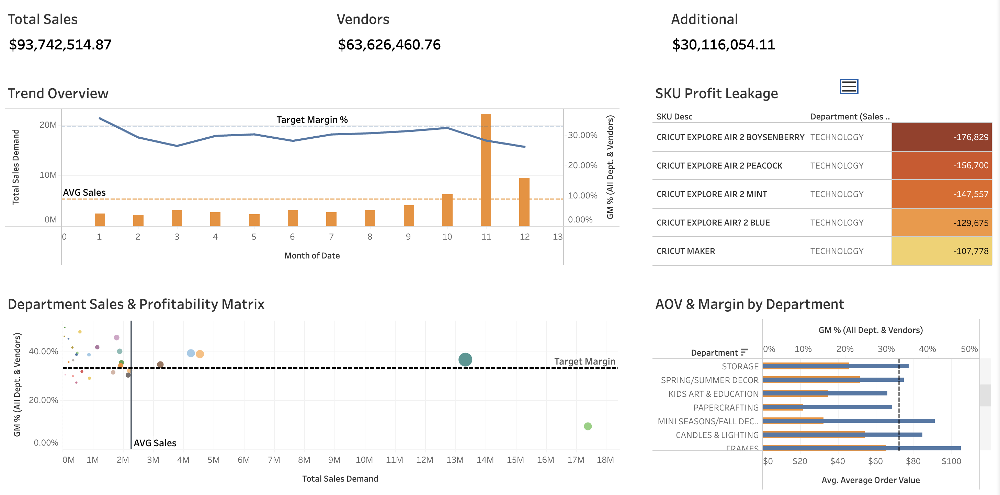

## E-Commerce Sales & Profitability Analysis
Interactive Tableau dashboard analyzing sales and profitability data for a globally operating e-commerce company. Built as a coursework project during my Master of Science in Management at Hult International Business School.

View the live interactive dashboard on Tableau Public by clicking on the image below →

### Objective
Perform a sales and profitability analysis to deliver actionable insights at both the department and SKU level — identifying top performers and surfacing profit leakage (negative-profit SKUs) that quietly drag down overall profitability.

### Key Insights
- Profit leakage is concentrated in Technology. All five worst-performing SKUs are Cricut products, each losing between roughly $108K and $177K. Despite strong sales volume, Technology shows the lowest gross margin of any department, a clear margin-recovery target.
- High-volume department dragging overall margin. The profitability matrix highlights one department generating ~$17M in sales while sitting well below target margin. Several lower-volume departments comfortably exceed target, suggesting the biggest profitability lever is fixing the high-volume underperformer rather than scaling the small wins.
- Q4 margin compression. Gross margin trends downward through the end of the year despite a strong November sales spike, signaling promotional or markdown pressure during peak season worth investigating in vendor negotiations.

### Tools & Methods
- Tableau Public
- Dashboard design, calculated fields, reference lines, parameter controls
- Data preparation, modeling, and visualization design from a multi-table sales dataset
